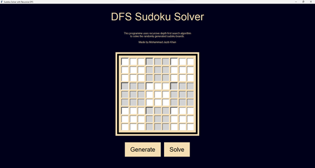
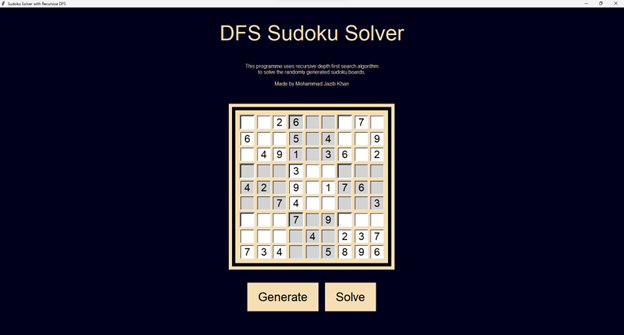
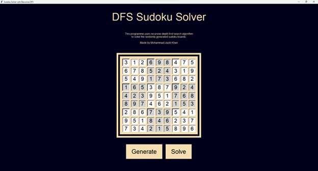

# Sudoku Solver with Recursive DFS

This program provides a graphical interface for generating and solving Sudoku puzzles using a recursive Depth-First Search (DFS) algorithm. The Sudoku solver generates a random board, displays it, and solves it while showing the intermediate steps.

## Features

- **Graphical User Interface (GUI):** Built with Tkinter to provide an interactive experience.
- **Sudoku Generation:** Generates a random Sudoku puzzle.
- **Sudoku Solving:** Solves the generated Sudoku puzzle using DFS.
- **Visualization:** Displays the Sudoku board before and after solving.

## Prerequisites

- Python 3.x
- Tkinter (usually included with Python)

## How to Run

1. **Ensure you have Python installed.**
2. **Run the script:**

```sh
python sudoku_solver.py
```

## Usage

1. **Start the Application:** Launch the application by running the script. A window titled "Sudoku Solver with Recursive DFS" will appear.
2. **Generate a Sudoku Puzzle:** Click the "Generate" button to create a new random Sudoku puzzle.
3. **Solve the Sudoku Puzzle:** Click the "Solve" button to solve the generated Sudoku puzzle.
4. **View Results:** The application will display the initial and solved Sudoku boards.

## Code Structure

- **Functions:**
  - `get_board_from_string(board)`: Converts a board string to a 2D list.
  - `generate_sudoku_board()`: Generates a new Sudoku puzzle.
  - `fill_board(board)`: Recursively fills the board to create a complete puzzle.
  - `valid(board, num, pos)`: Checks if a number can be placed in a given position.
  - `find_empty(board)`: Finds the next empty cell in the board.
  - `remove_numbers(board, num_to_remove)`: Removes numbers to create the puzzle.
  - `solve_board(board)`: Solves the Sudoku puzzle using DFS.
- **Classes:**
  - `SudokuSolver`: Contains methods for finding empty cells, checking number validity, and solving the board.
  - `SudokuGUI`: Manages the GUI elements and user interactions.

## Example

Here are examples of the application's interface at different stages:

### Initial GUI



This image shows the initial GUI when the application is launched.

### Generated Sudoku Board



This image shows the Sudoku board after clicking the "Generate" button.

### Solved Sudoku Board



This image shows the Sudoku board after clicking the "Solve" button, displaying the solved puzzle.

---

Feel free to reach out for any queries or suggestions.
